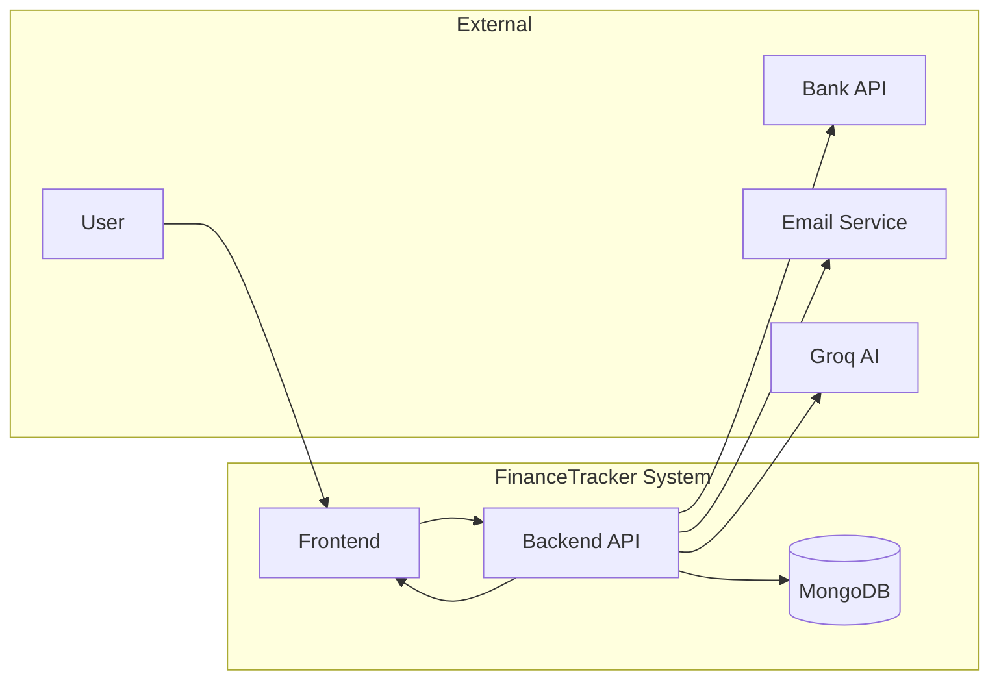

# Data Flow Diagrams (DFD) for FinanceTracker

This document contains DFD tables and diagrams for FinanceTracker: Level 0 (context) and Level 1 (expanded core services).

---

## Terminology
- External Entity: Actor outside the system (user, bank, email provider, AI).
- Process: Unit of work inside the system.
- Data Store: Persistent storage (database collections).
- Data Flow: Data movement between entities, processes, and stores.

---

## Level 0 — Context

### External Entities
| ID | Name | Description |
|----|------|-------------|
| E1 | User | End user interacting via frontend (web/mobile) |
| E2 | Bank | External bank APIs for account linking (optional) |
| E3 | Email Service | SMTP provider for verification and alerts |
| E4 | Groq AI | External AI service for chat/insights |

### System (single process)
| ID | Name | Description |
|----|------|-------------|
| P0 | FinanceTracker System | Entire application (frontend + backend + DB) |

### Data Stores (within system)
| ID | Name | Description |
|----|------|-------------|
| D1 | Users | User accounts, credentials, profiles |
| D2 | Expenses | User expenses and transactions |
| D3 | Budgets | User budgets and limits |
| D4 | Notifications | In-app notifications and alerts |
| D5 | BankAccounts | Bank account metadata & verification status |

### Key Data Flows (Level 0)
| From | To | Data |
|------|----|------|
| E1 (User) | P0 (System) | Register, Login, Create/Read/Update/Delete expenses/budgets, Requests for reports/insights |
| P0 (System) | E1 (User) | UI responses, reports, notifications, insights |
| P0 (System) | E3 (Email Service) | Verification emails, password reset, alerts |
| P0 (System) | E4 (Groq AI) | Prompt for insights and chat replies |
| P0 (System) | E2 (Bank) | Bank account link / verification requests |


### Mermaid (Level 0)


---

## Level 1 — Core Services (expanded)

### Processes (Level 1)
| ID | Name | Description |
|----|------|-------------|
| P1.1 | Auth Service | Register, login, email verify, password reset, sessions |
| P1.2 | Expense Service | Create/read/update/delete expenses, recurring logic |
| P1.3 | Budget Service | Create/read/update/delete budgets, enforce limits |
| P1.4 | Analytics Service | Aggregation, trends, recommendations |
| P1.5 | Notification Service | Generate/store/send notifications and alerts |
| P1.6 | Export Service | Generate CSV/JSON reports and scheduled exports |
| P1.7 | Admin Service | Account verification, admin actions |
| P1.8 | Chat AI Service | Prompt Groq AI, format responses, save insights |

### Data Stores (Level 1)
| ID | Name | Contains |
|----|------|--------|
| D1 | Users | id, name, email, passwordHash, emailVerified, role, createdAt |
| D2 | Expenses | id, userId, amount, category, date, notes, recurring, createdAt |
| D3 | Budgets | id, userId, category, limit, period, createdAt |
| D4 | Notifications | id, userId, title, message, read, data, createdAt |
| D5 | BankAccounts | id, userId, bankName, accountNumberMasked, verified, metadata |
| D6 | Exports | id, userId, type, fileUrl, createdAt |
| D7 | Sessions | sessionId, userId, expiresAt |

### External Entities (Level 1)
| ID | Name |
|----|------|
| E1 | User |
| E2 | Bank API |
| E3 | Email Provider |
| E4 | Groq AI |

### Data Flows (Level 1)
| From | To | Data | Notes |
|------|----|------|-------|
| E1 (User) | P1.1 (Auth) | Registration/Login payload | Triggers create/read in `D1` and session `D7` |
| P1.1 (Auth) | D1 (Users) | User record | Store user metadata |
| P1.1 (Auth) | E3 (Email) | Verification / reset email | Outgoing email flow |
| E1 (User) | P1.2 (Expense) | Expense create/update requests | Persist to `D2` |
| P1.2 (Expense) | D2 (Expenses) | Expense records | CRUD operations |
| P1.2 (Expense) | P1.5 (Notification) | Budget threshold events | When limit exceeded |
| P1.3 (Budget) | D3 (Budgets) | Budget records | CRUD operations |
| P1.4 (Analytics) | D2/D3 | Aggregated data | Reads `D2` and `D3` to compute trends |
| P1.8 (Chat AI) | E4 (Groq AI) | Prompt with user data | External API call (no PII unless user consents) |
| E4 (Groq AI) | P1.8 (Chat AI) | Insight / response | Formatted for UI and optionally stored in `D6` or as `D4` notification |
| P1.6 (Export) | D6 (Exports) | Export metadata | Provides downloadable link back to user |
| E2 (Bank API) | P1.5 / P1.7 | Account verification payload | Admin verification flow updates `D5` |


### Mermaid (Level 1)
```mermaid
flowchart TD
  subgraph UserLayer
    U[User]
  end

  subgraph Frontend
    UI[Frontend]
  end

  subgraph Backend[Backend Services]
    Auth[Auth Service\n(P1.1)]
    Expense[Expense Service\n(P1.2)]
    Budget[Budget Service\n(P1.3)]
    Analytics[Analytics Service\n(P1.4)]
    Notify[Notification Service\n(P1.5)]
    Export[Export Service\n(P1.6)]
    Admin[Admin Service\n(P1.7)]
    ChatAI[Chat AI Service\n(P1.8)]
  end

  subgraph DB[Data Stores]
    Users[(D1 Users)]
    Expenses[(D2 Expenses)]
    Budgets[(D3 Budgets)]
    Notifs[(D4 Notifications)]
    Banks[(D5 BankAccounts)]
    Exports[(D6 Exports)]
    Sessions[(D7 Sessions)]
  end

  U --> UI --> Auth
  Auth --> Users
  UI --> Expense
  Expense --> Expenses
  UI --> Budget
  Budget --> Budgets
  Expense --> Notify
  Notify --> Notifs
  Analytics --> Expenses
  Analytics --> Budgets
  ChatAI --> Exports
  ChatAI -->|calls| AI[Groq AI]
  Admin --> Banks
  Admin --> Notifs
  Export --> Exports
  Auth --> Sessions
  BankAPI[Bank API] --> Admin
  Email[Email Provider] --> Auth

  style Backend fill:#f9f,stroke:#333,stroke-width:1px
  style DB fill:#ffe,stroke:#333,stroke-width:1px
```

---

## How to use this DFD set
1. Level 0 gives a high-level context for stakeholders: who interacts with the system and which external services are involved.
2. Level 1 expands the internal services and the key data stores so developers can map responsibilities and integration points.
3. Use the tables for documentation, onboarding, security reviews, and to derive sequence diagrams for specific flows (e.g., payment, export, password reset).

---

## Notes & Privacy
- Do NOT send full PII or raw credentials to external AI or third-party services unless explicitly consented and secured.
- Mask bank account numbers; store only masked or tokenized values in `D5`.
- Keep email, OpenAI, and DB keys in environment variables — never in source control.

---

If you want, I can also add Level 2 DFDs for individual subsystems (e.g., Expense Service internals) or generate PNG/SVG exports of these Mermaid diagrams.
